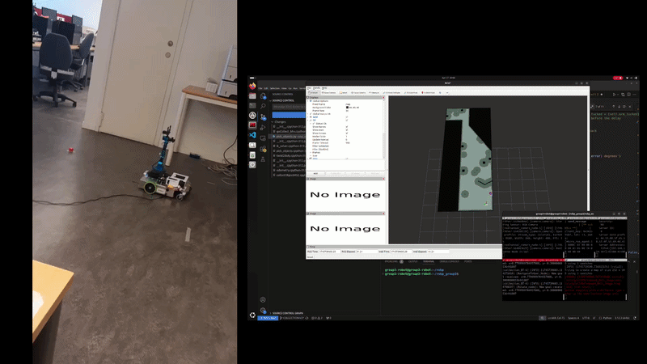

# DD2419 - Project Course in Robotics and Autonomous Systems

This repository contains the software implementation and project files for the **DD2419 Project Course in Robotics and Autonomous Systems** at KTH Royal Institute of Technology. 

The course focuses on the broad, interdisciplinary field of robotics, emphasizing how methods are used in practice and integrated into a complete, autonomous system.

## 🤖 Hardware
The project is built to control and interact with a mobile robot equipped with:
*   A robotic arm
*   An RGB-D camera (depth and color sensing)
*   A 2D laser scanner (LiDAR)

## 💻 Software & Technologies
*   **ROS (Robot Operating System):** The core framework used for robot control, simulation, and node communication.
*   **Language:** Python / C++
*   **Version Control:** Git & GitHub

## 🎓 System Goals & Objectives

**Primary System Goal**
The overarching objective of the robotic system is to autonomously explore a defined workspace, locate and categorize specific items, and physically collect and transport them to designated drop-off boxes/baskets. 

**Core Objectives**
*   **Autonomous Exploration and Mapping:** The system must navigate and explore the workspace while successfully avoiding obstacles. It is required to generate a map that records the exact locations of all identified objects and drop-off boxes.
*   **Object Detection and Classification:** During the exploration phase, the robot must accurately detect objects in its environment and classify them into four specific categories: plushie animals, spheres, cubes, and boxes. 
*   **Collection and Placement:** During the collection phase, the system must navigate to the mapped objects, pick them up using a robotic arm, and transport them to the nearest classified box to deposit them.

## Demo Videos

  

  

## 👥 Team Members
*   Francisco Miranda
*   Dominik Friedrich
*   Sebastian Christensson
*   Sebastian Gerreth
*   Panos Skoulaxinos

## 📜 Acknowledgements
*   **Institution:** KTH Royal Institute of Technology
*   **Division:** EECS / Robotics, Perception and Learning
